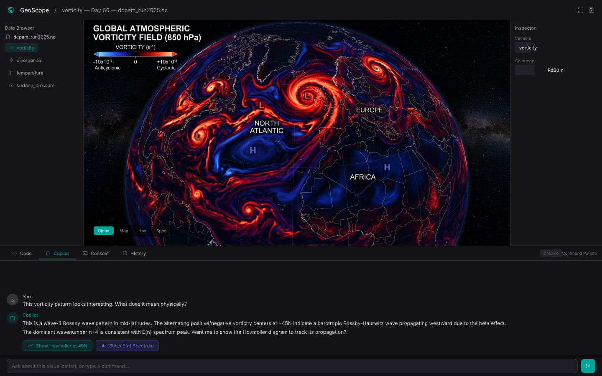
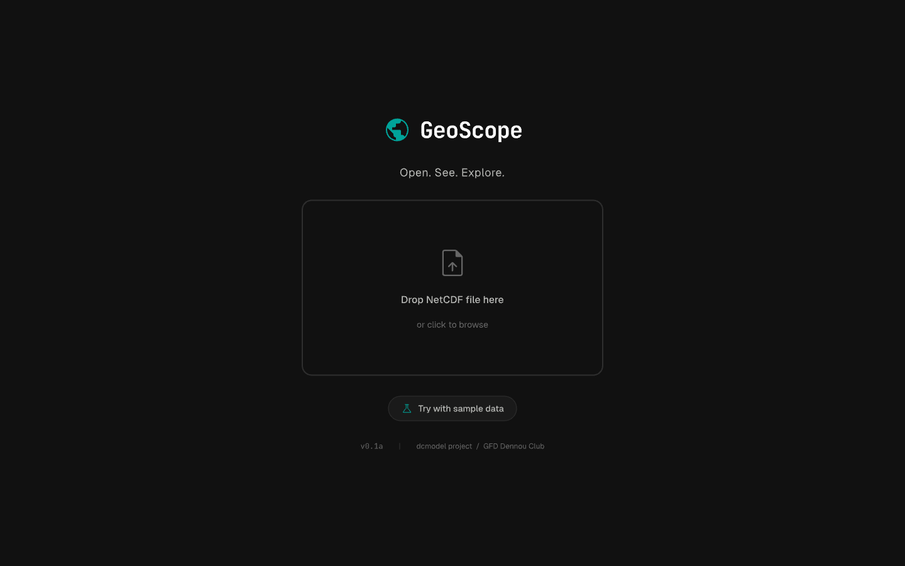
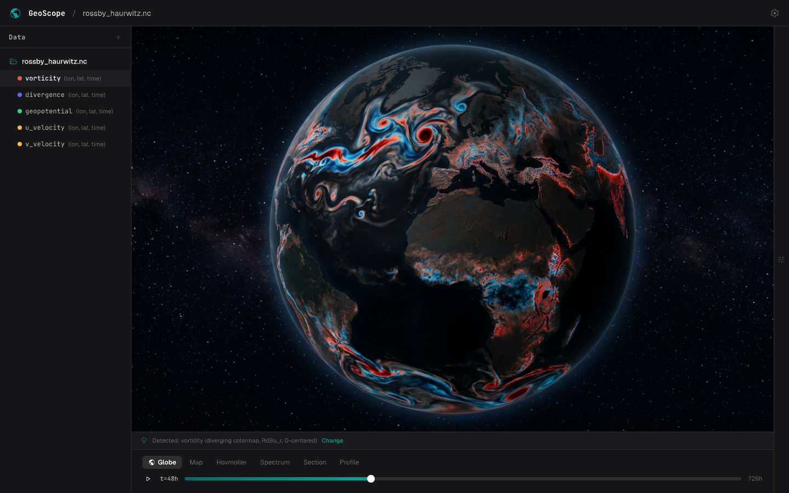
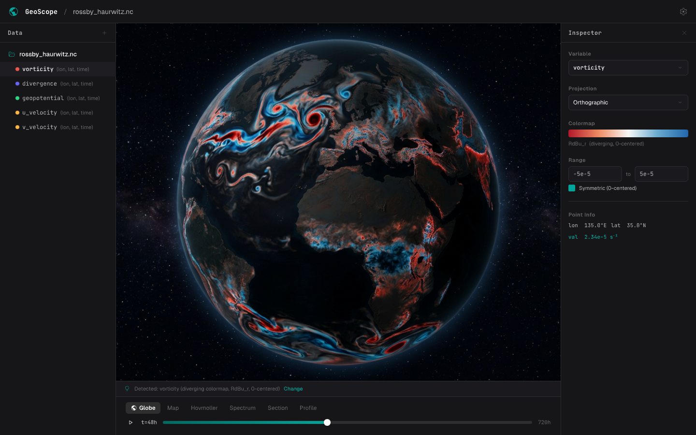
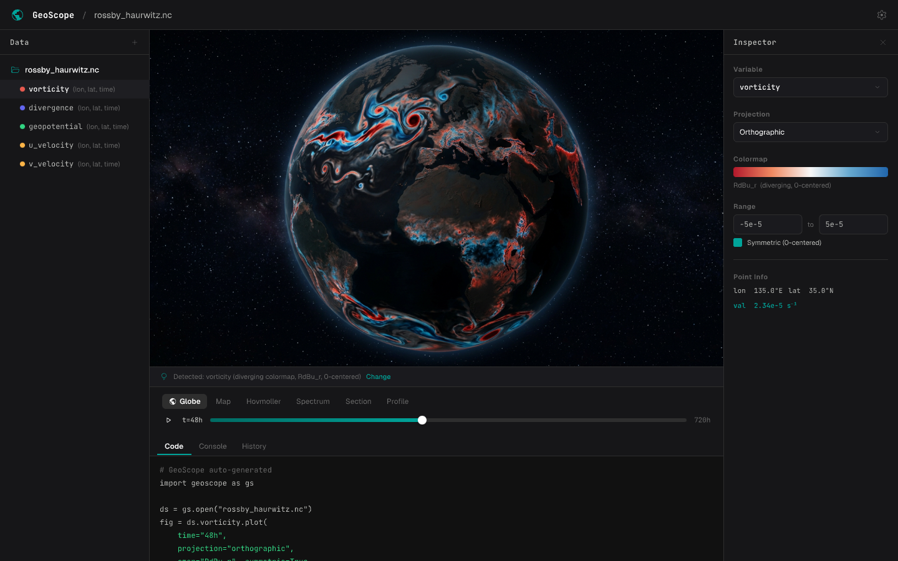
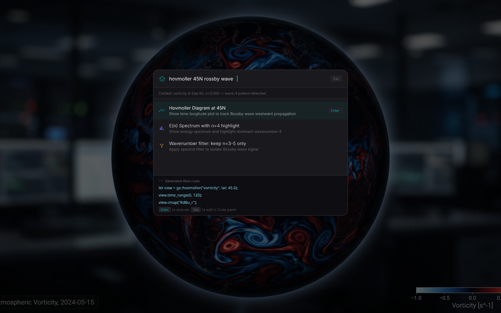
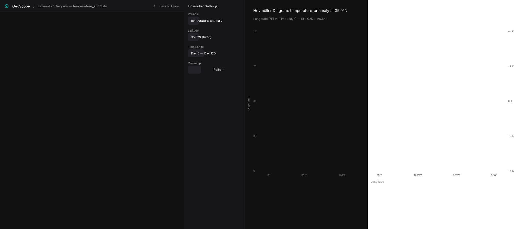
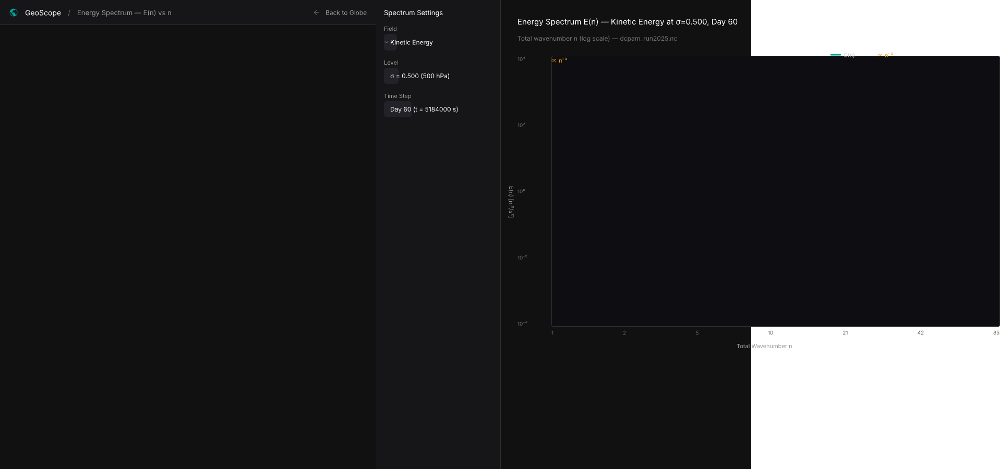

# GeoScope

**Open. See. Explore.** — Smart & Interactive.

A next-generation GFD (Geophysical Fluid Dynamics) data visualization desktop app. Drop a NetCDF, get an instant 3D globe, and let an LLM Copilot explain the physics. A modern replacement for GrADS/Panoply.

<p align="center"></p>


---

## Vision

Drop a NetCDF file, instantly see your data on a 3D globe. Rotate, explore, and every GUI action becomes reproducible code. An LLM Copilot explains the physical meaning of what you see and suggests next analysis steps.

## Key Features (Planned)

### Zero-Config Visualization
- Drag & drop NetCDF -> instant 3D globe rendering
- 3-stage variable inference: CF standard_name -> heuristics -> dimension structure
- Automatic colormap selection based on physical quantity

### Direct Manipulation
- Rotate the globe, zoom in, click for time series
- One-click switch between Globe, Map, Hovmoller, Spectrum views
- Google Earth-style mouse controls

### Code Generation
- All GUI operations recorded as Python/Rhai code
- "Recipe" files for reproducible figures
- GUI Master mode: code always reflects current state

### LLM Copilot
- **Chat**: "What does this vorticity pattern mean?" -> Physical explanation with GFD domain knowledge
- **Command Palette** (Cmd+K): Natural language -> Rhai code -> preview -> execute
- **Hybrid LLM**: Cloud API for deep explanations, local LLM for fast commands (works offline)
- **Privacy**: Only metadata & statistics sent to LLM, never raw data

### Progressive Disclosure
| Level | UI State | Target |
|-------|----------|--------|
| L0 | Welcome screen + file drop | First launch |
| L1 | Globe + sidebar + time slider | Beginners |
| L2 | + Inspector + Data Browser + Copilot | Daily users |
| L3 | + Code editor (Rhai/Python) | Power users |

## Screenshots (Mockups)

> Design mockups created in [Pencil](https://pencil.evolves.dev). Implementation has not started yet.

### L0 Welcome — Drop a file, start exploring
<p align="center"></p>

### L1 Basic View — Instant globe rendering
<p align="center"></p>

### L2 Explorer — Full panel layout
<p align="center"></p>

### L3 Code Mode — GUI actions become code
<p align="center"></p>

### LLM Copilot Chat — Ask about your data
<p align="center"></p>

### Command Palette — Natural language commands
<p align="center"></p>

### Hovmoller Diagram
<p align="center"></p>

### Energy Spectrum E(n)
<p align="center"></p>

## Tech Stack

| Layer | Technology | Rationale |
|-------|-----------|-----------|
| GUI | egui + egui_dock | Mature docking UI, native wgpu integration |
| Rendering | wgpu | WebGPU-based, future browser portability |
| Data I/O | netcdf-rs | Active maintenance under georust |
| Scripting (MVP) | Rhai | Lightweight, safe, embeddable |
| Scripting (future) | PyO3 | Python familiarity for researchers |
| LLM (cloud) | Anthropic API etc. | High-quality explanations |
| LLM (local) | llama.cpp / candle (TBD) | Offline command parsing |

## Relationship to dcmodel

GeoScope is part of the [dcmodel](https://www.gfd-dennou.org/) family — numerical models and libraries for GFD developed by the GFD Dennou Club.

```
ispack-rs (spectral transforms)
    |
spmodel-rs (spectral models)
    |
GeoScope (visualization) <-- you are here
```

Primary use case is visualizing output from ispack-rs/spmodel-rs, but any CF-compliant NetCDF data is supported.

## Roadmap

| Version | Goal | Status |
|---------|------|--------|
| **v0.1a** | Tech PoC: wgpu + egui + globe rendering | Not started |
| **v0.1b** | Usable minimum: Data Browser, Inspector, Hovmoller, Spectrum | Planned |
| **v0.2** | Code Panel, LLM Copilot (Explain + Explore), recipes | Planned |
| **v0.3** | Comparison mode, export, LLM Suggest mode | Planned |
| **Future** | Browser version (WebAssembly + WebGPU) | Planned |

## Documentation

- [`docs/PRD.md`](docs/PRD.md) — Product Requirements Document (v0.3.0)
- [`docs/DESIGN_REVIEW.md`](docs/DESIGN_REVIEW.md) — Expert panel design review
- [`docs/MOCKUP_GUIDE.md`](docs/MOCKUP_GUIDE.md) — Mockup screen map & persona validation

## Contributing

This project is in the design phase. Feedback is very welcome!

If you work in GFD, atmospheric science, or oceanography and have opinions about visualization tools, please open an issue or reach out.

## Acknowledgments

- [GFD Dennou Club](https://www.gfd-dennou.org/) — the research community behind dcmodel
- [ISPACK](https://www.gfd-dennou.org/arch/ispack/) by K. Ishioka — the spectral transform library that started it all
