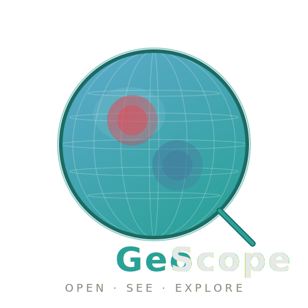

# GeoScope

<p align="center"></p>

<p align="center"><strong>Open. See. Explore.</strong> — GFD Data Visualization, Reimagined.</p>

<p align="center">


</p>

---

A next-generation desktop app for visualizing geophysical fluid dynamics (GFD) data.
Drop a NetCDF file, get an instant 3D globe with smart variable inference — no config needed.

Built as a modern replacement for GrADS / Panoply / ncview.

## Key Features

### Views

| View | Description |
|------|-------------|
| **Globe** | Interactive 3D sphere with wgpu rendering, camera rotation & zoom, atmospheric glow effect |
| **Map** | Equirectangular, Mollweide, and Polar Stereographic (N/S) projections with pan & zoom |
| **Hovmoller** | Time-longitude heatmap diagram |
| **Cross-Section** | Vertical slice heatmap (Fix Lat / Fix Lon) |
| **Profile** | 1D line graph — vertical profile or time series with hover crosshair |
| **E(n) Spectrum** | Log-log energy spectrum plot |

### Overlays

| Overlay | Description |
|---------|-------------|
| **Vector Arrows** | Wind field arrows on Globe/Map with auto u/v pair detection |
| **Contour Lines** | Isolines via Marching Squares with value labels (Globe/Map) |
| **Streamlines** | RK4-integrated streamlines with arrowheads |
| **Trajectory** | Particle trajectory with full path history, start marker, and current position dot |

### Data Intelligence

- **3-Stage Variable Inference** — CF standard_name → name heuristics → data statistics
- **Visualization Suggestion** — Auto-recommends view, colormap, and overlays based on variable analysis
- **Trajectory Pair Detection** — Auto-finds 1D lon/lat variable pairs for trajectory overlay
- **Wind Pair Detection** — Auto-detects u/v wind component pairs
- **Units-Aware** — Auto-converts radians to degrees for trajectory data

### Interaction

- **Time Animation** — Play/pause with adjustable speed
- **Level Selection** — Vertical level slider for 3D data
- **Colormap Range** — Slice / Global / Manual scaling + symmetric (0-centered) mode
- **Point Info** — Hover on Map to see lat/lon/value
- **Multi-File** — Open multiple NetCDF files, switch between them
- **Drag & Drop** — Drop NetCDF files to open instantly
- **PNG Export** — Save with resolution scaling (1x/2x/4x), colorbar, and title
- **Code Generation** — View equivalent Python (xarray + cartopy + matplotlib) code for current state

### 10 Colormaps

Sequential: Viridis, Plasma, Inferno, Cividis, YlGnBu, Turbo
Diverging: RdBu_r, Coolwarm, BrBG, PiYG

## Keyboard Shortcuts

| Key | Action |
|-----|--------|
| `Space` | Play / Pause animation |
| `Left` / `Right` | Step time backward / forward |
| `Up` / `Down` | Step level up / down |
| `1`–`6` | Switch view (Globe / Map / Hovmoller / Spectrum / Profile / Section) |
| `G` | Toggle Grid / Smooth interpolation |
| `C` | Toggle contour overlay |
| `V` | Toggle streamline overlay |
| `T` | Toggle trajectory overlay |

## Quick Start

### Prerequisites

- Rust toolchain (stable)
- HDF5 1.10

```bash
# macOS
brew install hdf5@1.10

# Set HDF5 path (already configured in .cargo/config.toml for Homebrew default)
```

### Build & Run

```bash
git clone https://github.com/daktu32/geoscope.git
cd geoscope
cargo run --release -- samples/rossby_haurwitz_sample.nc
```

Or launch without arguments and use the **+** button in the Data Browser to open files.

### Sample Data

Three sample NetCDF files are included in [`samples/`](samples/):

| File | Description | Try |
|------|-------------|-----|
| `rossby_haurwitz_sample.nc` | Rossby-Haurwitz wave | Globe + contour (`C`) + streamlines (`V`) |
| `beta_gyre_sample.nc` | Beta-plane gyre | Trajectory (`T`) + animation (`Space`) |
| `held_suarez_sample.nc` | 3D atmosphere (10 levels) | Cross-section (`6`) + level slider |

See [`samples/README.md`](samples/README.md) for details.

## Tech Stack

| Layer | Technology | Version |
|-------|-----------|---------|
| GUI Framework | eframe + egui_dock | 0.33 / 0.18 |
| GPU Rendering | wgpu (via eframe) | 27 |
| Data I/O | netcdf-rs | 0.12 |
| Image Export | image | 0.25 |
| File Dialog | rfd | 0.15 |
| HDF5 Backend | hdf5 (Homebrew) | 1.10 |

## Architecture

```
src/
├── main.rs                 # Entry point (D&D, 1280x800)
├── app.rs                  # App state, eframe integration, dock layout
├── data/
│   ├── mod.rs              # DataStore, NetCDF I/O, field/profile/trajectory loading
│   └── inference.rs        # 3-stage variable inference + visualization suggestion
├── renderer/
│   ├── common.rs           # Shared types, view_proj matrix, colormap LUT
│   ├── globe.rs            # 3D globe (wgpu, UV sphere, WGSL shader)
│   ├── map.rs              # 2D map (wgpu, Equirect/Mollweide/Polar)
│   ├── hovmoller.rs        # Hovmoller diagram (egui)
│   ├── cross_section.rs    # Vertical cross-section (egui)
│   ├── spectrum.rs         # E(n) energy spectrum (egui)
│   ├── profile.rs          # 1D profile / time series (egui)
│   ├── contour.rs          # Contour lines — Marching Squares (egui)
│   ├── streamline.rs       # Streamlines — RK4 integration (egui)
│   ├── trajectory.rs       # Trajectory overlay (egui)
│   ├── vector_overlay.rs   # Wind arrows (egui)
│   └── export.rs           # PNG export
├── codegen/
│   ├── mod.rs              # Code generation hub
│   └── python.rs           # Python code generator
└── ui/mod.rs               # Tab system (DataBrowser, Viewport, Inspector, CodePanel)
```

## Roadmap

| Version | Goal | Status |
|---------|------|--------|
| v0.1 | Globe + Map + Hovmoller + Spectrum + Export | Done |
| v0.2 | Mollweide + Cross-Section + Vector Overlay + Level/Range control | Done |
| v0.3 | Point Info + Profile + Contour + Streamline + Polar Stereo | Done |
| **v0.4** | **Visualization Suggestion + Trajectory + Code Panel** | **Done (current)** |
| v0.5 | LLM Copilot + Bidirectional Code Panel + Video export | Planned |
| Future | WebAssembly + WebGPU browser version | Planned |

## Relationship to dcmodel

GeoScope is part of the [dcmodel](https://www.gfd-dennou.org/) ecosystem — numerical models and libraries for GFD developed by the GFD Dennou Club.

```
ispack-rs  →  spmodel-rs  →  GeoScope
(spectral      (spectral      (visualization)
 transforms)    models)        ← you are here
```

Primary use case: visualizing output from ispack-rs / spmodel-rs shallow water and atmospheric models. Any CF-compliant NetCDF file is supported.

## Documentation

- [`docs/PRD.md`](docs/PRD.md) — Product Requirements Document
- [`PROGRESS.md`](PROGRESS.md) — Development progress log

## License

MIT License. See [LICENSE](LICENSE) for details.

## Acknowledgments

- [GFD Dennou Club](https://www.gfd-dennou.org/) — the research community behind dcmodel
- [ISPACK](https://www.gfd-dennou.org/arch/ispack/) by K. Ishioka — the spectral transform library that started it all
